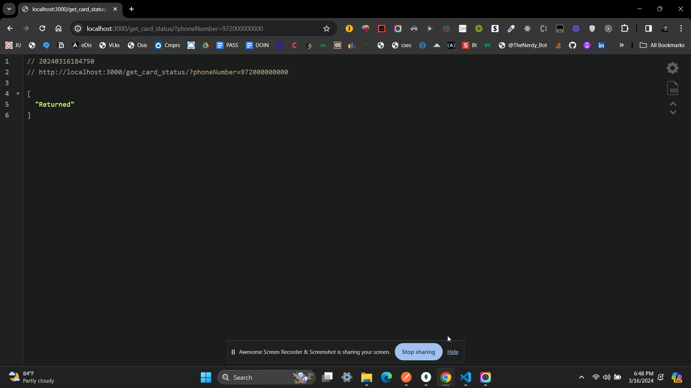

*PREVIEW*
<video controls src="sample.mp4" title="Title"></video>

*OUR DATABASE*

*THE CODE OUTPUT*

*DESCRIPTION*
I've built a Node.js server using Express and MongoDB to handle card status queries. It connects to a MongoDB database named 'card_status', defines a schema for card data, and sets up a route '/get_card_status' to accept queries based on phone numbers or card IDs. The server fetches the relevant data from MongoDB and handles errors. Finally, it listens on a port for incoming connections. This allows clients to query card status efficiently.

1. **Why Node.js and Express?**
   - I chose Node.js because it's good for handling lots of things happening at once.
   - Express.js is like a tool that helps us make websites and apps quickly and easily.

2. **Why MongoDB?**
   - MongoDB is a type of database that's flexible and easy to work with for this project.

3. **How the Code Works:**
   - I made a server that listens for requests.
   - When someone asks for information about a card, the code check if they gave us a phone number or a card ID.
   - Then it looks up that information in our database.
   - If it is found, the code send back the status of the card.
   - If not, it tell them the card isn't in our records.

4. **Improvements:**
   - Could make the error messages clearer.
   - It would be good to test the code to make sure it works correctly
